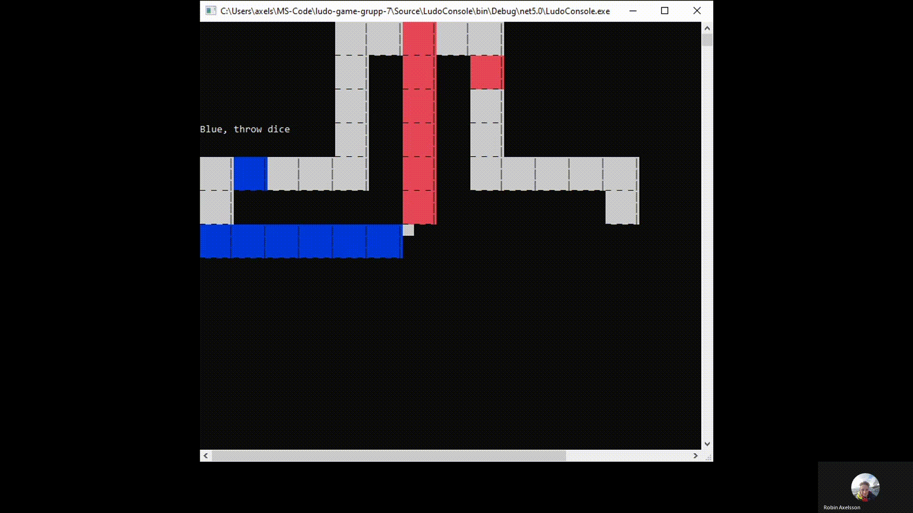

# Console Ludo Board Game V3

Version 3 aims to refactor and decouple past versions in form of a local game server, a web game server, multiple client interfaces with different pluggable databases.

## Older versions

[Ludo V1 - a console app with Entity Framework](https://github.com/RobinAxelsson/LudoV1)

[Ludo V2 - a SignalR web app](https://github.com/RobinAxelsson/LudoV2)

Project authors:

Albin Alm -> [github page](https://github.com/albinalm)

Robin Axelsson -> [github page](https://github.com/robinaxelsson)

Intentionally blank
